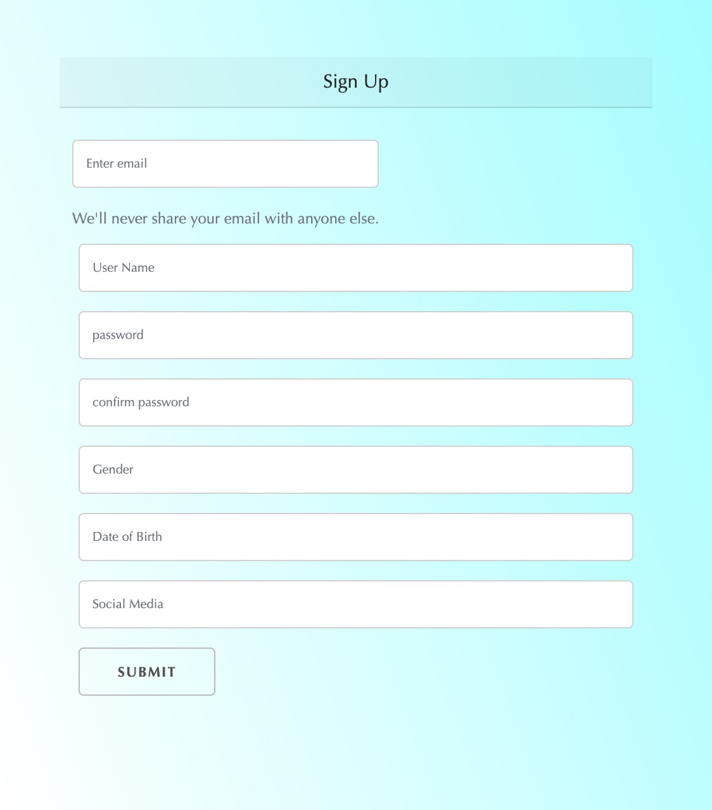
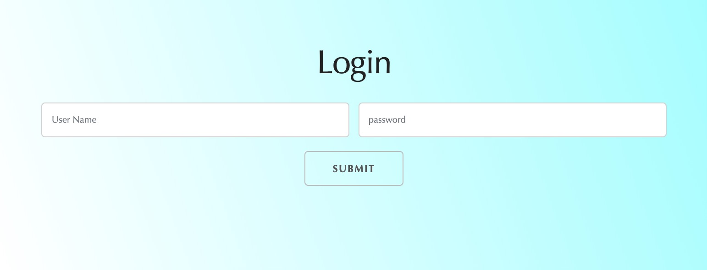
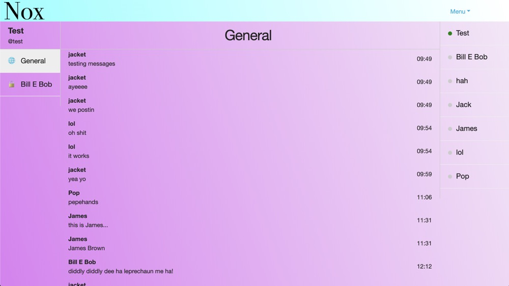

# NOX 2

Nox2 a dating and social app specifically designed for queer and trans folks. Because most dating apps are built with straight couples or cisgender gay men and lesbian women in mind, the way they function fundamentally doesn't work with the way queer/trans folks date and socialize and these apps often end up alienating members of these communities. 
Our app takes into account that most of our target audience dates less focusing on searching within a certain gender group and more based on personal interests and comfort zones/past experiences. Therefore, the "traditional" (in most dating apps) method of selecting search parameters based on gender isn't the most effective way for our audience. Instead, the app will be text-based: members can make a post about who they are, what they're looking for, etc;

## Overview

This is a MERN application that has a concise and easy to use UI, user can sign up and login, and this user's information will be displayed on the left sidebar. Users' data and posts data are saved in MongoDB, which could be updated and displayed dynamically with the users' creation.

In addition, any user could mark a post once, and if a post is marked more than three times, it will be deleted as an inappropriate post.

It is worth mentioning that the real-time chat function can be implemented. On the chat page, users can chat publicly or chat with a user individually.
 
> Deployed Link: [Click Here](https://nox2.herokuapp.com/)

## How to Use

#### Demo accounts:
> (User Name 1)
> Username: test
> Password: test

> (User Name 2)
> Username: 
> Password: 

> (User Name 3)
> Username: 
> Password: 

### Login
<!-- Users can sign up and login with their Username and Password. -->
<!--  -->

### Main page

### Chat page

## Technologies Used

- MongoDB
- Express
- React
- Node
- JavaScript
- CSS
- HTML
- Passport.js

## Authors

- Jack Shalenkova - https://jeanshotjack.github.io
- Sean Melvin - https://Sean8595.github.io
- Mustafa Muhammad - https://krismoosevisual.github.io/Bootstrap-Portfolio/
- Bailing Zhang - https://easonchang15530.github.io/Bootstrap-Portfolio
